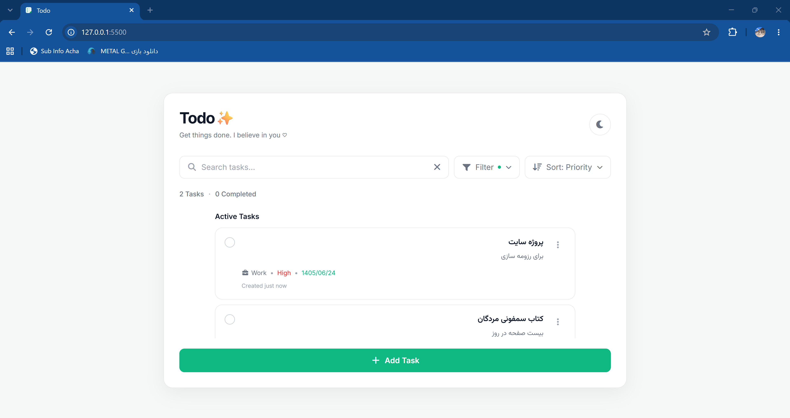
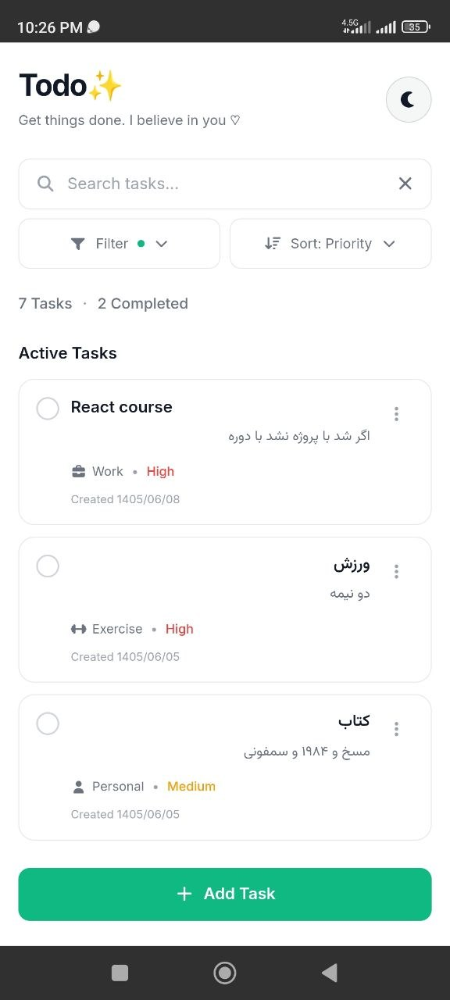
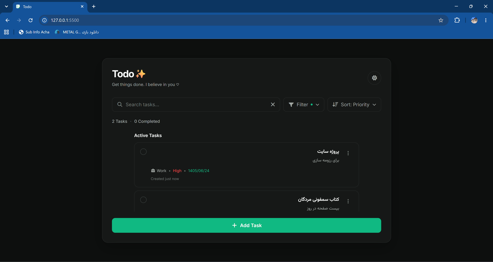
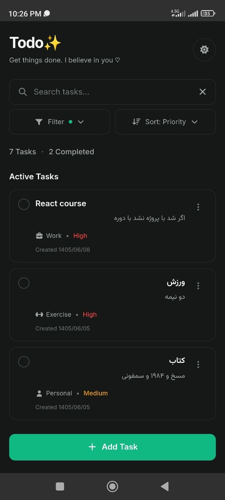
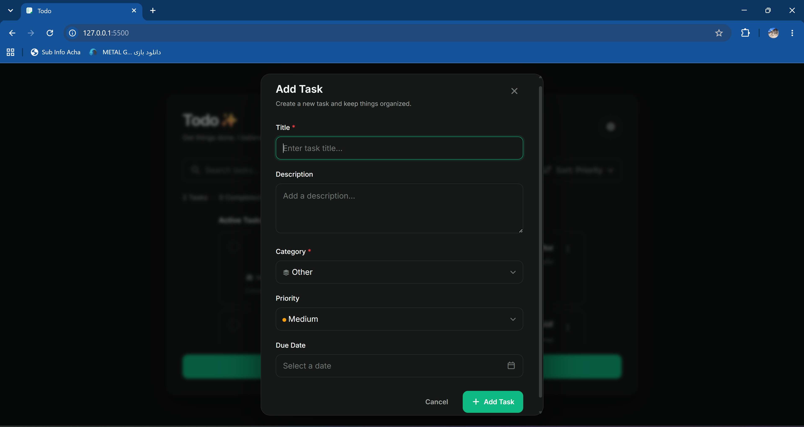
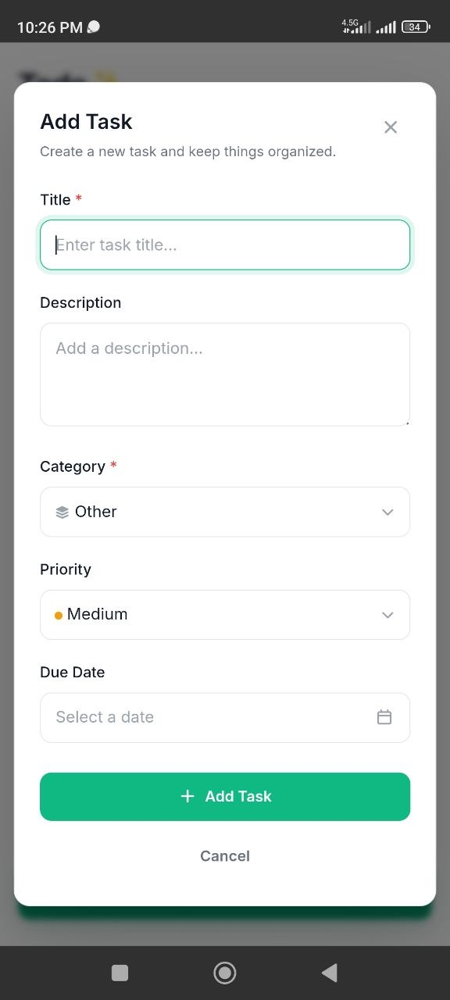

# Todo App
## 🌐 Live Demo

Try the application online:

[Open Todo App](https://saeed-motevalli.github.io/todo-app/)

## 📱 Android App

The Android version is available as a release APK.

[Download Android APK](https://github.com/Saeed-Motevalli/todo-app/releases/tag/v1.0.0)

<p align="center">
  
</p>

A modern and responsive task management web application built with **HTML, CSS, and Vanilla JavaScript**.

This project is a complete Todo application available as a responsive web application and an Android application using **Capacitor**.

The goal of this project was to build a clean, efficient, and user-friendly task management experience while practicing frontend development concepts, UI design, state management, and web-to-mobile application conversion.

---

# ✨ Features

## Task Management

- Create new tasks
- Edit existing tasks
- Delete tasks
- Mark tasks as completed
- Manage active and completed tasks separately

## Task Organization

- Search tasks instantly
- Filter tasks by:
  - Status
  - Priority
  - Category

- Sort tasks by:
  - Priority
  - Deadline
  - Created date
  - Alphabetical order

## User Experience

- Modern and minimal user interface
- Responsive design for desktop and mobile devices
- Dark mode support
- Smooth animations and transitions
- Toast notifications
- Custom dropdown menus
- Mobile-friendly interactions
- Clean and intuitive workflow

## Data Persistence

- Store tasks using LocalStorage
- Keep user data after refreshing the application
- No backend or external database required

---

# 🛠 Technologies Used

- HTML5
- CSS3
- JavaScript (ES6+)
- LocalStorage API
- Font Awesome
- Responsive Web Design
- Capacitor (Web to Android App Conversion)

---

# 📌 Technical Highlights

- DOM manipulation and event handling
- JavaScript-based application state management
- Client-side data persistence
- Responsive CSS layouts
- Clean separation between HTML, CSS, and JavaScript
- User-focused interface design
- Web application converted into an Android application using Capacitor

---

# 📱 Screenshots

## Light Mode

<p align="center">
  
</p>

<p align="center">
  
</p>

## Dark Mode

<p align="center">
  
</p>

<p align="center">
  
</p>

## Task Creation

<p align="center">
  
</p>

<p align="center">
  
</p>

---

# 📂 Project Structure

```text
Todo-App/

├── README.md
│
├── www/
│   ├── index.html
│   │
│   ├── css/
│   │   └── style.css
│   │
│   ├── js/
│   │   └── app.js
│   │
│   ├── img/
│   │
│   └── assets/
│
├── screenshots/
│   ├── light-mode.png
│   ├── light-mode-mobile-view.png
│   ├── dark-mode.png
│   ├── dark-mode-mobile-view.png
│   ├── add-task.png
│   └── add-task-mobile-view.png
│
├── android/
│
├── capacitor.config.*
│
└── package.json
```

---

# 🚀 Getting Started

## Clone the repository

```bash
git clone https://github.com/Saeed-Motevalli/todo-app.git
```

## Run Web Version

Open:

```text
www/index.html
```

in your browser.

## Run Android Version

The application can be built and run as an Android application using **Android Studio with Capacitor**.

---

# 🔮 Future Improvements

Possible improvements:

- Backend integration
- User authentication
- Cloud synchronization
- Online database support
- Drag and drop task management
- Multi-device data synchronization

---

# 👨‍💻 Author

**Saeed Motevalli**

Frontend Developer

GitHub: [Saeed-Motevalli](https://github.com/Saeed-Motevalli)
